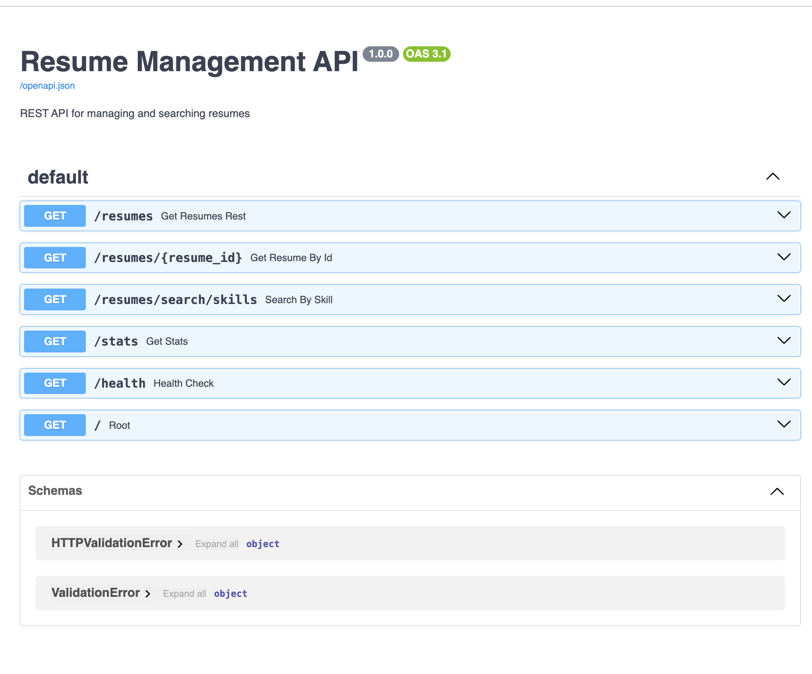
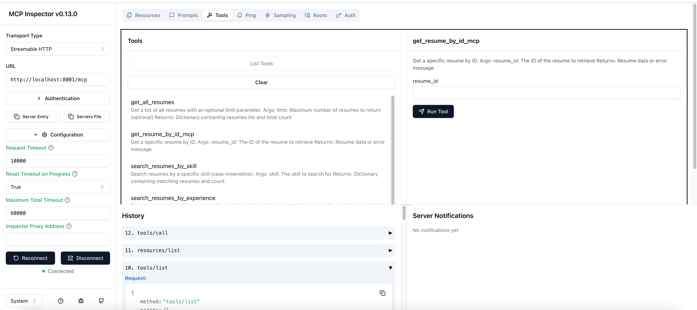
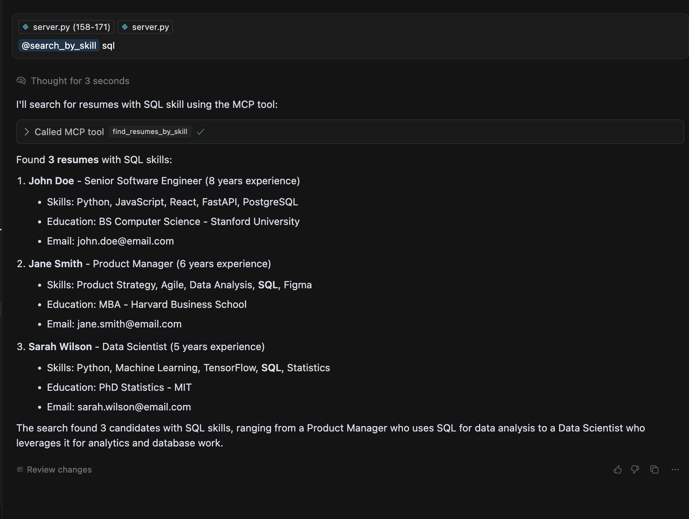

# Resume Chatbot Demo

A demonstration of the FastAPI + FastMCP resume server functionality with streaming HTTP support.


## Testing the API

### FastAPI Endpoints
1. Start the server:
   ```bash
   # From the backend directory
   cd ..
   python server.py
   ```

2. Access the Swagger UI:
   - Open your browser and navigate to `http://localhost:8000/docs`
   - This provides an interactive interface to test all available endpoints
   
### MCP Testing
#### MCP Inspector
1. Install the MCP Inspector:
   ```bash
   npm install -g @modelcontextprotocol/inspector
   ```

2. Connect to the MCP endpoint:
   ```bash
   npx @modelcontextprotocol/inspector
   ```
   - Connect to: `http://localhost:8000/mcp`
   

#### Curosr
If you use cursor, simply add this mcp.json under your local root /.cursor
```json
{
    "mcpServers": {
      "tally-mcp": {
        "url": "http://localhost:8000/mcp",
        "env": {
          "API_KEY": "value"
        }
      }
    }
  }
  ```
  
   You will be able to interact with inside cursor chat
## Development
TODO this should be dockerized. Stay tuned