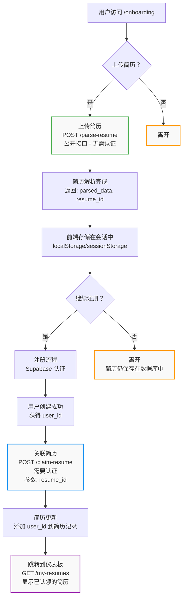

# Resume Upload Flow

## Overview
This document describes the user flow for uploading resumes before requiring authentication, maximizing resume collection while maintaining a smooth user experience.

## Flow Diagram



## Endpoint Details

### 1. POST /parse-resume (Public)
**Purpose:** Parse and store resume without authentication
- **Auth Required:** No
- **Request:** `multipart/form-data` with PDF file
- **Response:**
```json
{
  "success": true,
  "resume_id": 123,
  "parsed_data": {
    "name": "John Doe",
    "email": "john@example.com",
    "phone": "+1234567890",
    "location": "San Francisco, CA",
    "professional_summary": "...",
    "years_experience": 5,
    "skills": ["Python", "JavaScript", ...],
    "experience": [...],
    "education": [...],
    "languages": [...]
  },
  "message": "Resume parsed successfully"
}
```

### 2. POST /claim-resume (Authenticated)
**Purpose:** Associate anonymous resume with authenticated user
- **Auth Required:** Yes
- **Request:**
```json
{
  "resume_id": 123
}
```
- **Response:**
```json
{
  "success": true,
  "message": "Resume claimed successfully",
  "resume": {
    "id": 123,
    "user_id": "uuid-here",
    // ... rest of resume data
  }
}
```

### 3. GET /my-resumes (Authenticated)
**Purpose:** Get all resumes for authenticated user
- **Auth Required:** Yes
- **Response:**
```json
{
  "resumes": [...],
  "count": 1,
  "user_email": "john@example.com"
}
```

## Frontend Implementation

### Session Storage Strategy
```javascript
// After successful parse
const response = await fetch('/api/parse-resume', {
  method: 'POST',
  body: formData
});
const data = await response.json();

// Store in sessionStorage for current session
sessionStorage.setItem('pendingResume', JSON.stringify({
  resume_id: data.resume_id,
  parsed_data: data.parsed_data
}));

// After successful signup
const pendingResume = JSON.parse(sessionStorage.getItem('pendingResume'));
if (pendingResume) {
  await claimResume(pendingResume.resume_id);
  sessionStorage.removeItem('pendingResume');
}
```

## Benefits

1. **Maximum Conversion**: Users can experience value before committing
2. **Data Collection**: Capture resumes even from users who don't sign up
3. **Smooth UX**: No interruption in the user journey
4. **Simple Implementation**: Minimal changes to existing auth flow

## Database Considerations

The `resumes` table should:
- Allow `user_id` to be nullable
- Have an index on `user_id` for efficient queries
- Consider adding a `created_at` timestamp to track anonymous uploads
- Optionally add a cleanup job for old unclaimed resumes (e.g., after 30 days)