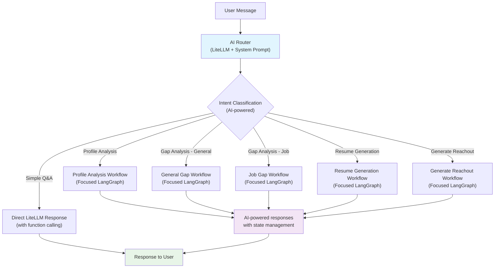

# Unified Chat Architecture: AI-First with Focused LangGraph Workflows

## Architecture Overview



## Core Principles

1. **AI-First**: Use LiteLLM for intelligence, not templates
2. **Focused Workflows**: Each LangGraph handles one specific conversation type
3. **Natural Conversations**: AI-generated responses that adapt to context
4. **Extensible Design**: Easy to add new workflows without affecting existing ones
5. **Clear State Management**: Each workflow manages only relevant state

## Implementation Components

### 1. AI-Powered Router
**File:** `backend/workflows/chat_router.py`

- Uses LiteLLM to intelligently classify user intent
- Considers conversation history and user context
- Routes to appropriate workflow or direct response

```python
class ChatRouter:
    ROUTER_SYSTEM_PROMPT = """
    You are a career assistant router. Analyze the user's message to determine 
    the most appropriate workflow.

    Available workflows:
    - DIRECT_RESPONSE: Simple questions, general chat
    - PROFILE_ANALYSIS: "Tell me about my profile", "What are my strengths"
    - GENERAL_GAP_ANALYSIS: "What skills am I missing?", "How can I improve?"
    - JOB_GAP_ANALYSIS: "How do I match against this job?", "What gaps do I have?"
    - RESUME_GENERATION: "Generate a resume", "Create a tailored resume"
    - GENERATE_REACHOUT: "Write a reachout message", "Generate outreach", "Help me reach out"

    Respond with ONLY the workflow name.
    """

    @staticmethod
    async def route_message(user_message: str, conversation_history: List[Dict], user_context: Dict = None) -> str:
        # AI-powered routing logic using LiteLLM
        pass
```

### 2. Base Workflow Class
**File:** `backend/workflows/base_workflow.py`

- Common interface for all workflows
- State management per workflow type
- AI-powered conversation handling

```python
class BaseWorkflowState(TypedDict):
    messages: List[Dict[str, Any]]
    user_id: int
    session_data: Dict[str, Any]
    workflow_complete: bool
    current_step: str

class BaseWorkflow(ABC):
    def __init__(self):
        self.graph = None
        self._workflow_sessions = {}
        self._build_graph()
    
    @abstractmethod
    def _build_graph(self):
        """Build the LangGraph workflow"""
        pass
    
    @abstractmethod
    def get_system_prompt(self) -> str:
        """Get workflow-specific system prompt"""
        pass
    
    async def process_message(self, user_message: str, user_id: int, session=None, context: Dict = None) -> Dict[str, Any]:
        """Process message through this workflow"""
        pass
```

### 3. Focused Workflows

#### Gap Analysis Workflow
**File:** `backend/workflows/gap_analysis_workflow.py`

- Handles both general and job-specific gap analysis
- Multi-step LangGraph process: analyze → identify gaps → suggest improvements
- AI-powered throughout with function calling

#### Profile Analysis Workflow
**File:** `backend/workflows/profile_analysis_workflow.py`

- Comprehensive profile analysis and strengths identification
- AI-generated insights and recommendations

#### Resume Generation Workflow
**File:** `backend/workflows/resume_generation_workflow.py`

- End-to-end resume creation and optimization
- Tailored to user's background and target roles

#### Generate Reachout Workflow
**File:** `backend/workflows/generate_reachout_workflow.py`

- Generates personalized outreach messages for networking/referrals
- Takes referrer description, user's resume, and job posting as inputs
- Creates compelling, professional reachout messages tailored to the specific context

### 4. Updated Main Chat Handler
**File:** `backend/chat.py`

```python
async def create_chat_completion(request: ChatCompletionRequest, session=None, current_user=None):
    # Step 1: AI-powered routing
    route = await ChatRouter.route_message(
        user_message=request.messages[-1].content,
        conversation_history=request.messages[:-1],
        user_context=await _build_user_context(current_user, session)
    )
    
    # Step 2: Handle based on route
    if route == "DIRECT_RESPONSE":
        return await _handle_direct_response(request, session, current_user)
    elif route == "GENERAL_GAP_ANALYSIS":
        workflow = GapAnalysisWorkflow("general")
        return await _handle_workflow_response(workflow, request, session, current_user)
    elif route == "GENERATE_REACHOUT":
        workflow = GenerateReachoutWorkflow()
        return await _handle_workflow_response(workflow, request, session, current_user)
    # ... other routes
```

## File Structure

```
backend/
├── chat.py                     # Updated main chat handler
├── workflows/
│   ├── __init__.py
│   ├── chat_router.py          # AI-powered routing
│   ├── base_workflow.py        # Base workflow class
│   ├── gap_analysis_workflow.py       # Gap analysis workflows
│   ├── profile_analysis_workflow.py   # Profile analysis workflow
│   ├── resume_generation_workflow.py  # Resume generation workflow
│   └── generate_reachout_workflow.py  # Generate reachout workflow
└── tools/
    ├── profile_tools.py        # Profile-related function tools
    ├── job_tools.py           # Job-related function tools
    └── analysis_tools.py      # Analysis function tools
```

## Benefits

- **Natural Conversations**: AI-generated responses vs robotic templates
- **Maintainable & Extensible**: Independent workflows, easy to add new types
- **Intelligent Routing**: AI understands context and intent
- **Focused State Management**: Each workflow manages only relevant state
- **Better User Experience**: Context-aware, adaptive conversations

---

## Implementation Prompt for Cursor/Claude

```
Please implement the unified chat architecture described in this document. 

Key requirements:
1. Create the AI-powered router (chat_router.py) that uses LiteLLM to classify user intent
2. Build the base workflow class (base_workflow.py) with LangGraph integration
3. Implement focused workflows for gap analysis, profile analysis, resume generation, and reachout generation
4. Update the main chat handler (chat.py) to use the new routing system
5. Ensure each workflow has its own state management and system prompts
6. Replace the current keyword-based routing with AI-powered classification
7. Make workflows use AI-generated responses instead of hardcoded templates

The architecture should be modular, extensible, and provide natural conversation experiences for career assistance.
``` 